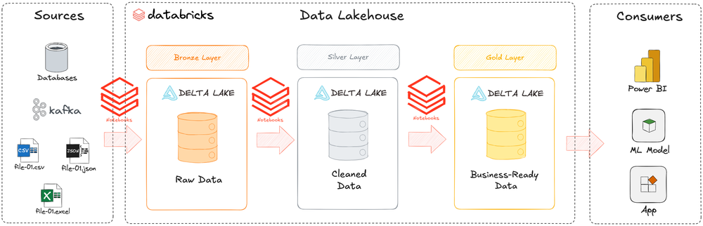
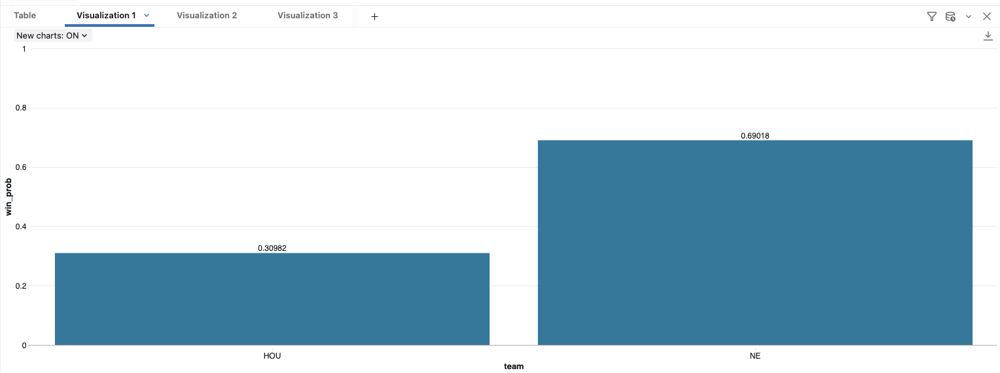
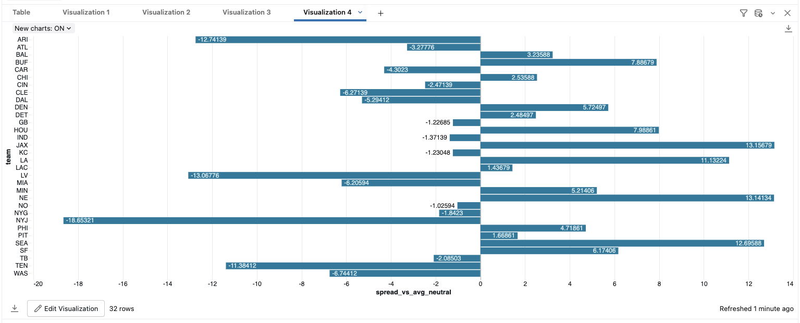

# nfl-databricks-lakehouse
Databricks SQL lakehouse (Bronze/Silver/Gold) + team spread ratings + matchup win probabilities (NFL demo project)

sql/ scripts

docs/ docs

data/samples/ outputs

images/ screenshots

# NFL Prediction Lakehouse in Databricks (Medallion Architecture)

This project is a Databricks SQL-only lakehouse demo that builds a **Bronze → Silver → Gold** pipeline for NFL analytics,
including **team spread ratings** and **matchup win probabilities**.

The NFL angle grabs attention. The real point is to demonstrate production-style analytics engineering:
clean modeling, reproducibility, validation, and communication.

---

## TL;DR Outputs (what you can look at in 10 seconds)
- **Matchup win probability** (example: NE vs HOU)  
  See: `data/samples/matchup_probability_v2_chart.csv`
- **Team spread ratings** (top/bottom sample)  
  See: `data/samples/team_spread_rating_v2_top_bottom.csv`

### Visuals

---

## Skills Demonstrated (what recruiters care about)
- **Databricks SQL** transformations and modeling
- **Unity Catalog organization** and medallion architecture (Bronze/Silver/Gold)
- **Delta tables + views**
- **Data cleaning**: typing, deduplication, null-handling
- **Window functions** (ROW_NUMBER) for recent-form features
- **Data quality checks** (key uniqueness, sanity checks, probability validation)
- **Chart-ready views** for dashboards

---

## Architecture (Medallion)
Catalog: `workspace`

Schemas:
- `workspace.nfl_bronze` — raw ingested CSV tables (minimal changes)
- `workspace.nfl_silver` — clean, typed, validated tables (trust layer)
- `workspace.nfl_gold` — features, model outputs, and chart views (business layer)

More detail: `docs/architecture.md`

---

## Repo Structure
- `sql/` — the runnable pipeline scripts
- `docs/` — sources, limitations, architecture, data dictionary
- `data/samples/` — small outputs that GitHub can display instantly
- `images/` — screenshots of Databricks charts + architecture diagram

---

## How to Run (Databricks SQL) — Foolproof Order
Open Databricks SQL Editor and run scripts in this order:

1. `sql/00_setup.sql`  
   Creates schemas in catalog `workspace` (`nfl_bronze`, `nfl_silver`, `nfl_gold`)

2. `sql/10_bronze_ingest.sql`  
   Documents/executes ingestion patterns for Bronze tables (CSV → Delta)

3. `sql/20_silver_clean.sql`  
   Builds cleaned Silver tables:
   - `weather_2025`
   - `market_odds_2025`
   - `team_game_basic_2025`

4. `sql/30_gold_features.sql`  
   Builds Gold feature tables and team power:
   - `weather_features_2025`
   - `market_odds_features_2025`
   - `game_features_2025`
   - `team_power_v2_2025`
   - View: `team_spread_rating_v2`

5. `sql/40_gold_model.sql`  
   Builds modeling outputs:
   - `model_params_2025`
   - `target_game`
   - `matchup_probability_v2`

6. `sql/50_views_and_charts.sql`  
   Creates chart-ready views:
   - `matchup_probability_v2_chart`
   - `team_power_ranking_v2`

7. `sql/90_data_quality_checks.sql`  
   Runs repeatable validation checks (duplicates, sanity checks, probability sums, etc.)

Optional reset:
- `sql/99_drop_objects.sql` drops outputs so you can rebuild cleanly.

---

## Data Sources
See `docs/sources.md` for the public source links and Bronze-layer mapping.

---

## Limitations (Honest + Important)
This version is intentionally lightweight and does **not** yet include:
- injury reports / player availability
- snap counts / depth chart changes
- play-by-play efficiency (EPA)
- last-second market odds movement

Details and next steps: `docs/limitations.md`

---

What I’m strong at:
- SQL (Databricks/Spark style)
- building clean, validated datasets
- turning messy inputs into trustworthy outputs
- communicating results with simple visuals and clear assumptions
